## Cloud&DevOps Fundamentals Autumn 2022 AWS Cloud Basic

1. Read the terms of Using the AWS Free Tier and the ability to control their own costs. 

2. Register with AWS (first priority) or alternatively, you can request access to courses in AWS Academy if you are currently a student of certain University.  
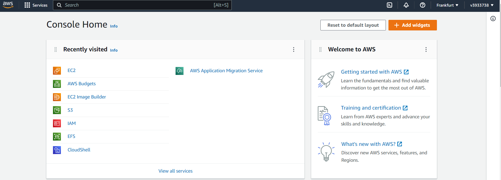

3. Find the hands-on tutorials and AWS Well-Architected Labs for your AWS needs. Explore list of step-by-step tutorials for deferent category. Use, repeat as many as you can and have fun))  
4. Register and pass courses on AWS Educate. Filter by checking Topic Cloud Computing and Foundational Level. Feel free to pass more.  
5\. Register and pass free courses on AWS Skillbuilder. AWS Cloud Practitioner Essentials: Core Services, AWS Cloud Practitioner Essentials: Cloud Concepts. Try AWS Cloud Quest: Cloud Practitioner.  
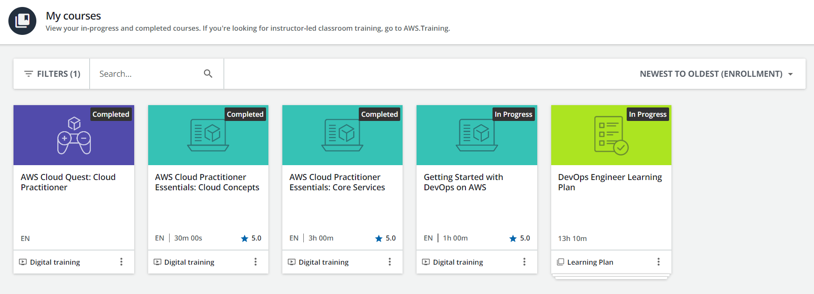

6. Pass free courses on Amazon qwiklabs

7. Review Getting Started with Amazon EC2. Log Into Your AWS Account, Launch, Configure, Connect and Terminate Your Instance. Do not use Amazon Lightsail. It is recommended to use the t2 or t3.micro instance and the CentOS operating system.

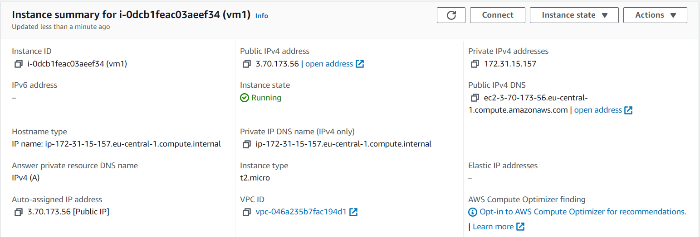  
8. Create a snapshot of your instance to keep as a backup.

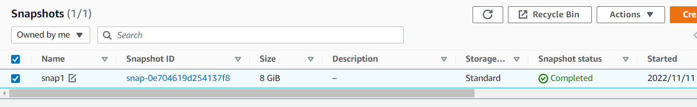  
9. Create and attach a Disk_D (EBS) to your instance to add more storage space. Create and save some file on Disk_D.

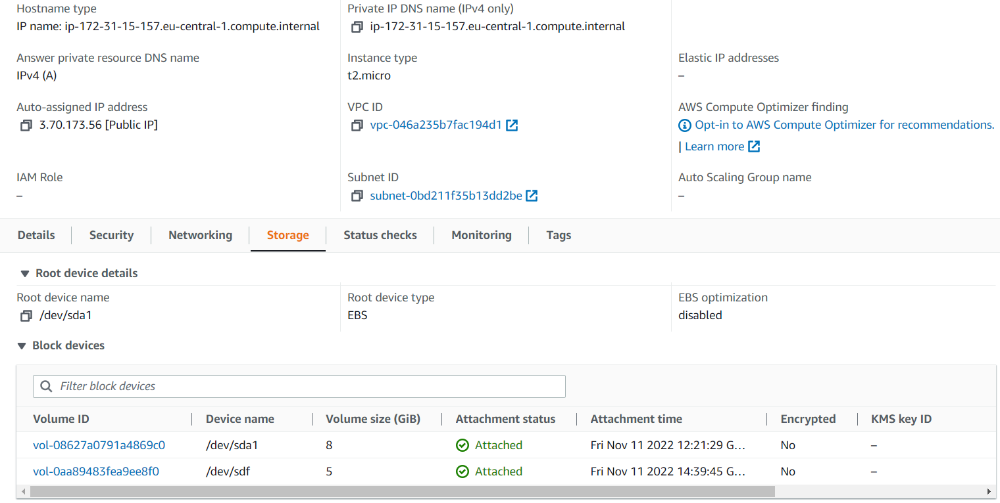

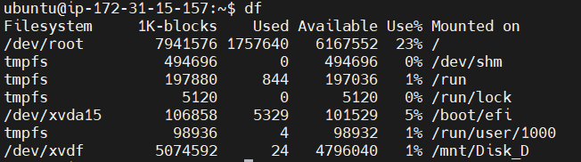

10. Launch the second instance from backup.

11. Detach Disk_D from the 1st instance and attach disk_D to the new instance.

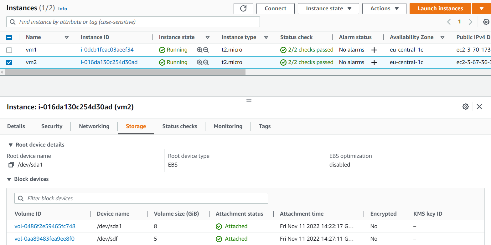

12. Review the 10-minute example. Explore the possibilities of creating your own domain and domain name for your site. Note, that Route 53 not free service. Alternatively you can free register the domain name \*.PP.UA and use it.

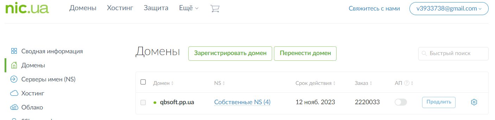

13. Launch and configure a WordPress instance with Amazon Lightsail link

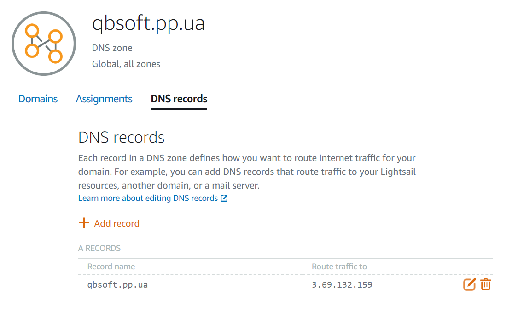

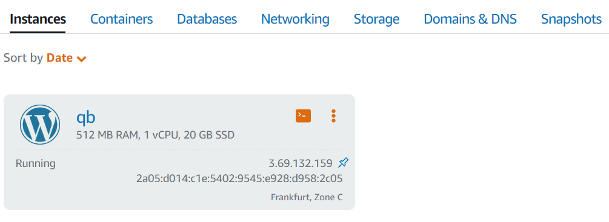

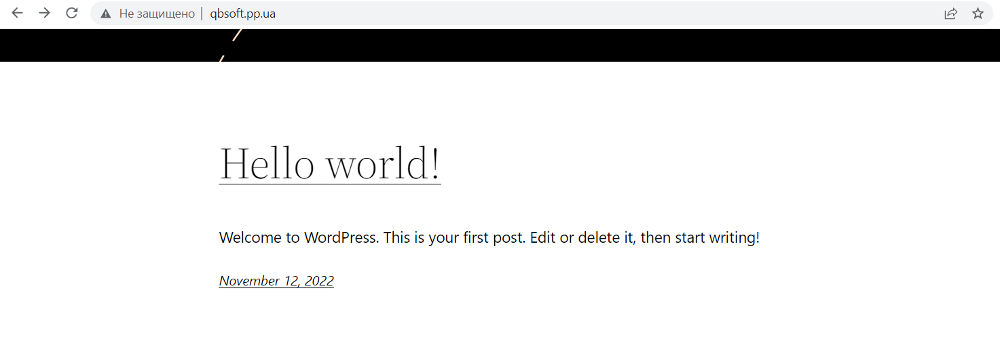

14. Review the 10-minute Store and Retrieve a File. Repeat, creating your own repository.

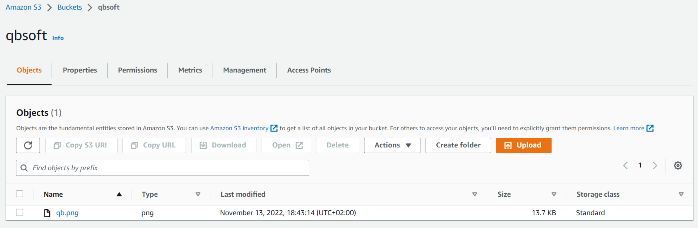

15. Review the 10-minute example Batch upload files to the cloud to Amazon S3 using the AWS CLI. Create a user AWS IAM, configure CLI AWS and upload any files to S3.

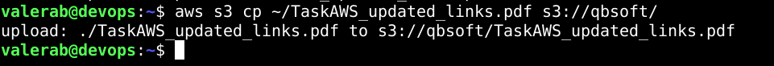

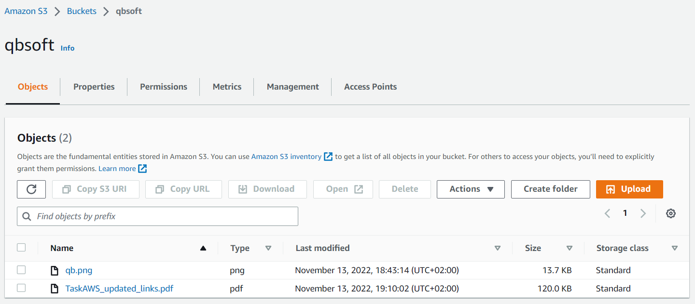

16. Review the 10-minute example Deploy Docker Containers on Amazon Elastic Container Service (Amazon ECS). Repeat, create a cluster, and run the online demo application or better other application with custom settings.

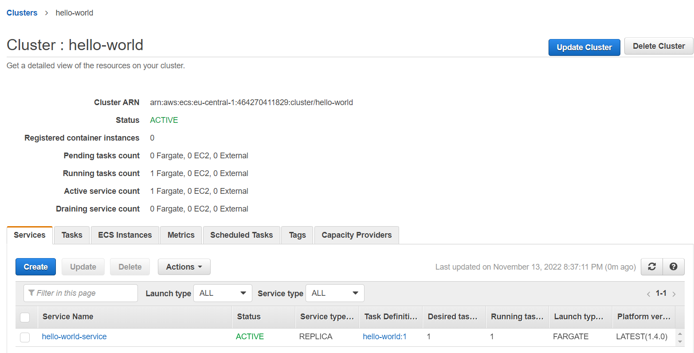

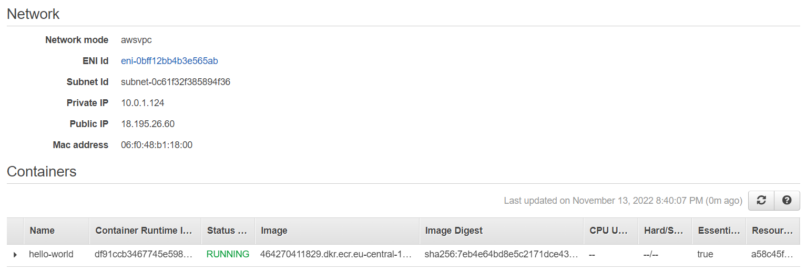

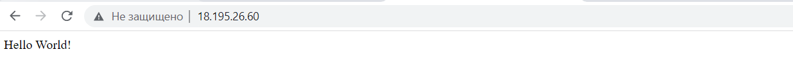

17. Run a Serverless "Hello, World!" with AWS Lambda.

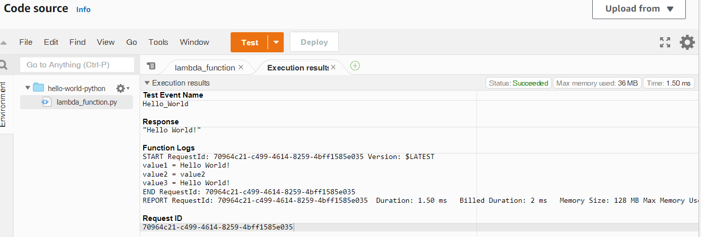

18. Create a static website on Amazon S3, publicly available (link1 or link2 - using a custom domain registered with Route 53). Post on the page your own photo, the name of the educational program (EPAM Cloud&DevOps Fundamentals Autumn 2022), the list of AWS services with which the student worked within the educational program or earlier and the full list with links of completed labs (based on tutorials or qwiklabs). Provide the link to the website in your report and СV.

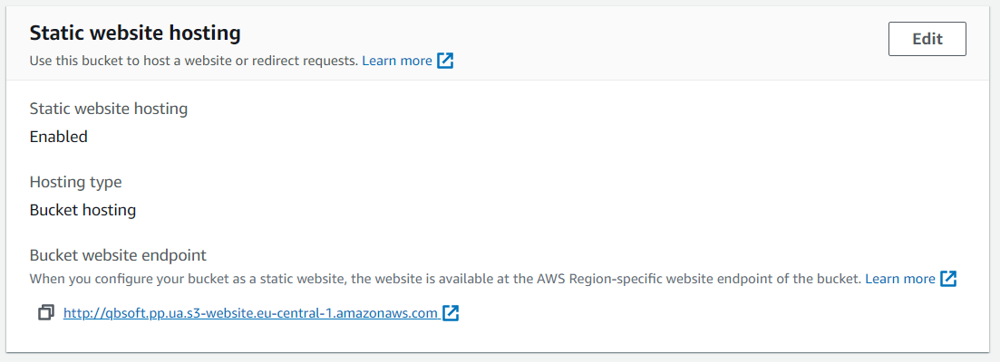

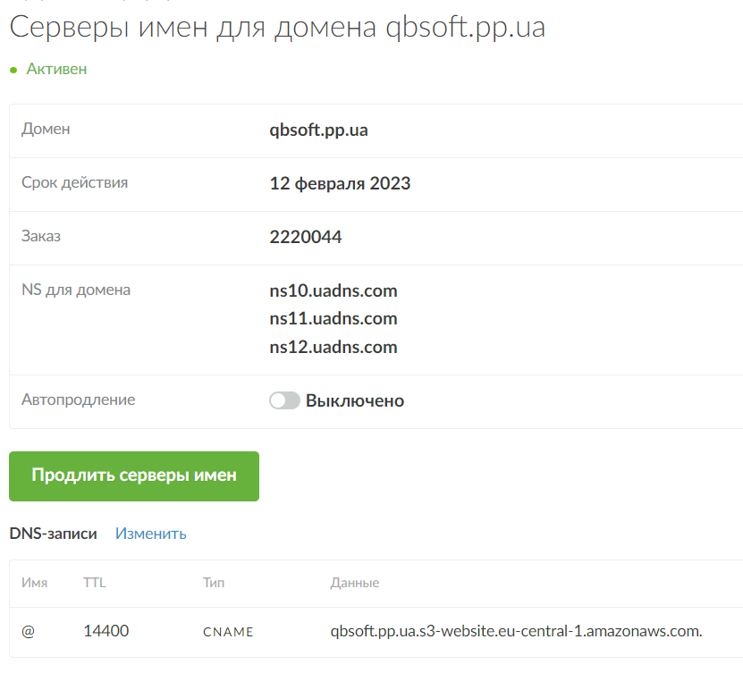

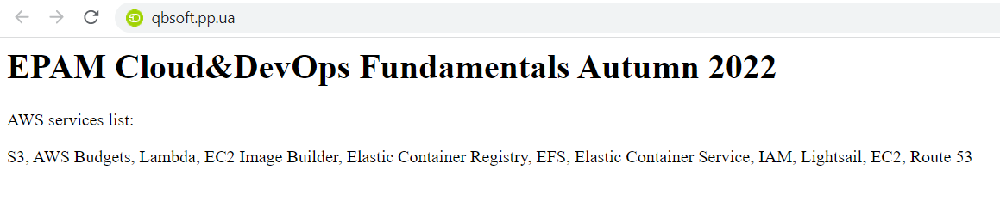
