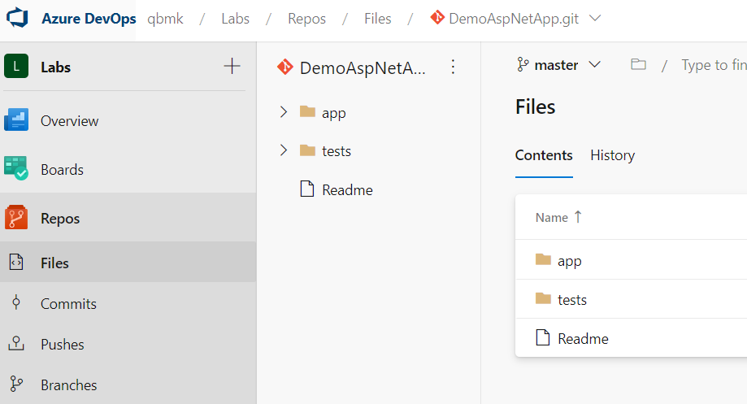
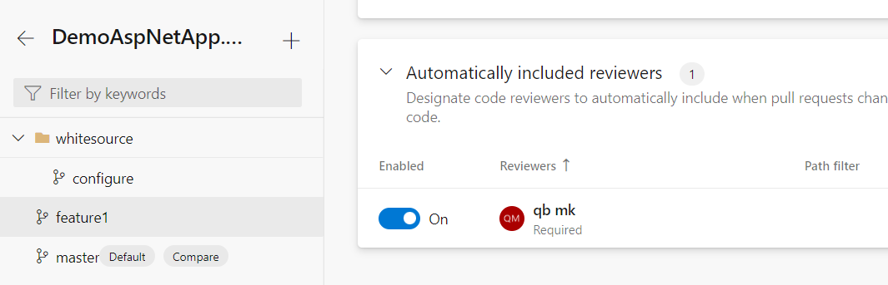
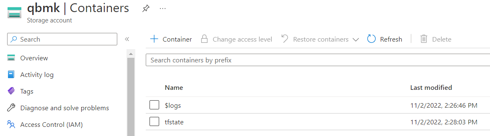
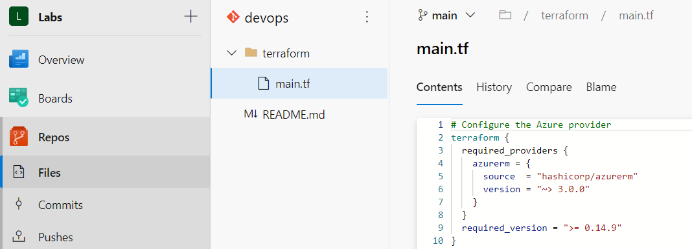
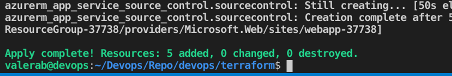
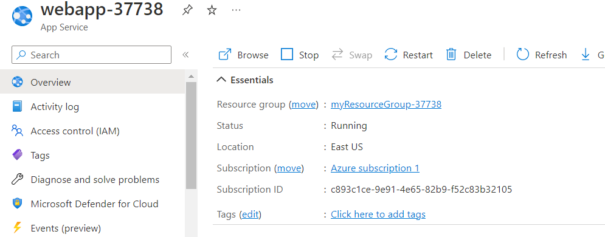
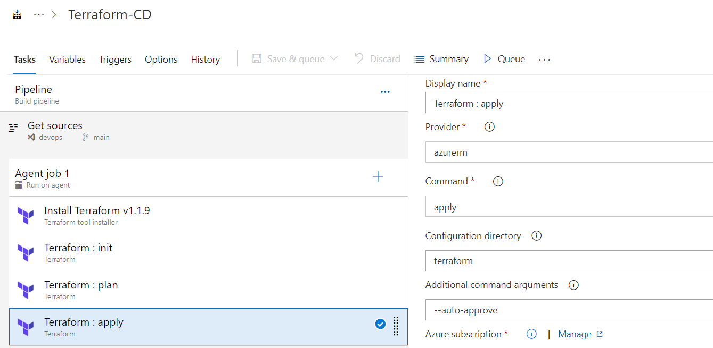
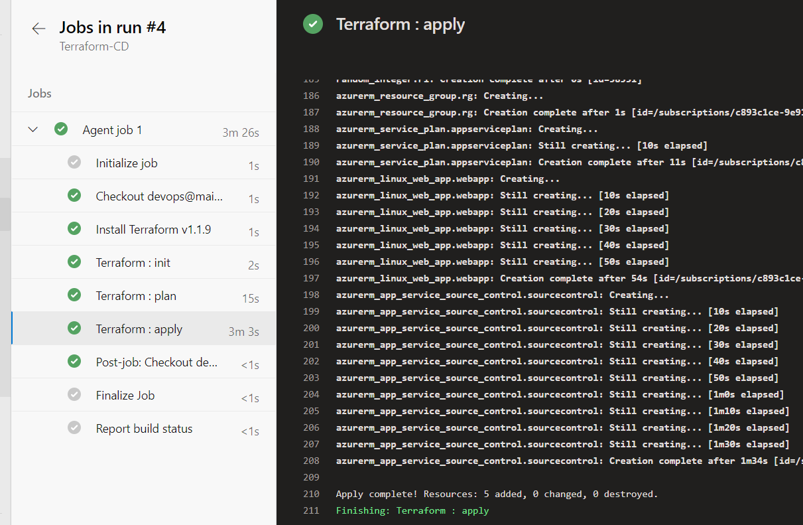

# Homework

## Part 1 – Configure application

1.  Create a service connection in a Azure DevOps project to your subscription - <https://learn.microsoft.com/en-us/azure/devops/pipelines/library/service-endpoints?view=azure-devops&tabs=yaml>
2.  Find a .net pet project for the experiments
3.  Build your app locally .net project via dotnet tool. dotnet restore/build/run
4.  Create an Azure DevOps repo - <https://learn.microsoft.com/en-us/azure/devops/repos/git/create-new-repo?view=azure-devops> You can use import repository to import from existing source control version like github

1.  Create a branching policy for you application. Added yourself as a reviewer - <https://learn.microsoft.com/en-us/azure/devops/repos/git/branch-policies?view=azure-devops&tabs=browser> As branching strategy use a github flow (It will be applied by default when you strict commit to your main branch)

## Part 2 – Configure a pipeline to deploy infrastructure

### Terraform storage account

1.  Create a separate resource group and deploy azure storage account - <https://learn.microsoft.com/en-us/azure/storage/common/storage-account-create?tabs=azure-portal>
2.  Create a container with the name “tfstate” and remember the name. use portal settings. In this storage account you will be store your tf state file

### Terraform preparation

1.  Create another repo to store devops code
2.  Create a folder terraform
3.  Add app service implementation - <https://learn.microsoft.com/en-us/azure/app-service/provision-resource-terraform>
4.  Integrate application insights with app service.

    

5.  Updated backend “azurerm” according to the guide - <https://learn.microsoft.com/en-us/azure/developer/terraform/store-state-in-azure-storage?tabs=azure-cli>
6.  Run az login or Connect-AzAccount to connect the azure subscription from your local
7.  Run terraform apply to deploy infrastructure

    

    

### Create a terraform pipeline

1.  Create a yaml pipeline with the following steps: terraform install, terraform init, terraform plan/apply. Plan is an optional one
2.  Inside yaml pipeline add trigger to main branch. The scenario – when main is updated, pipeline should run automatically - <https://learn.microsoft.com/en-us/azure/devops/pipelines/yaml-schema/trigger?view=azure-pipelines>
3.  Added 3 steps – terraform install, terraform init, terraform plan/apply. Plan is an optional one. You may add it as 4th step

    

    
