Database Administration TASK DB

PART 1

3. Select a subject area and describe the database schema, (minimum 3 tables)

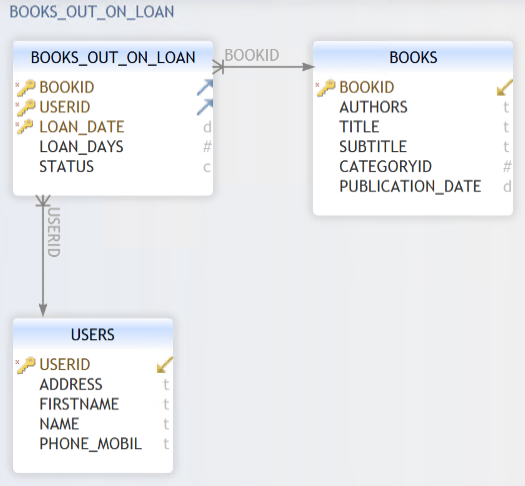

4. Create a database on the server through the console.  
 5. Fill in tables.

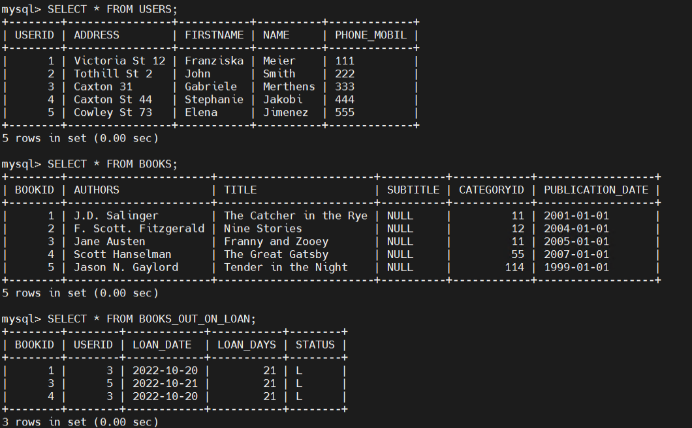

6. Construct and execute SELECT operator with WHERE, GROUP BY and ORDER BY.

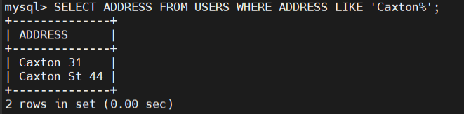

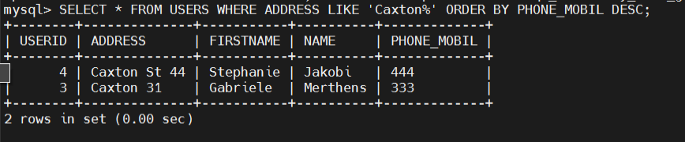

7. Execute other different SQL queries DDL, DML, DCL.

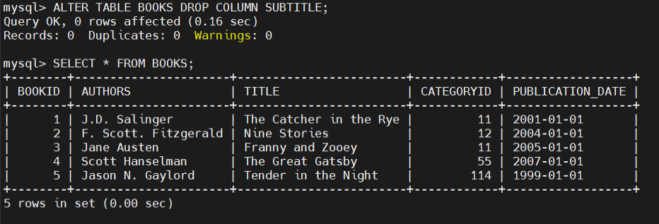

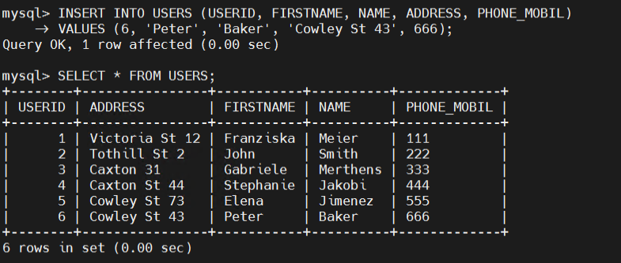

8. Create a database of new users with different privileges. Connect to the database as a new user and verify that the privileges allow or deny certain actions.

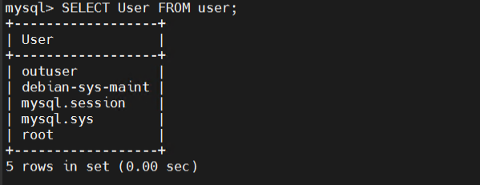

9. Make a selection from the main table DB MySQL.

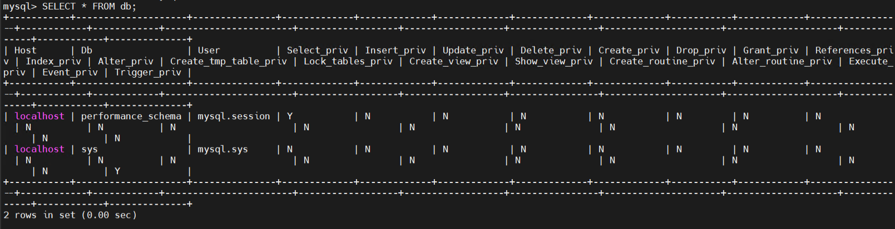

PART 2

10. Make backup of your database. 11.Delete the table and/or part of the data in the table. 12.Restore your database.

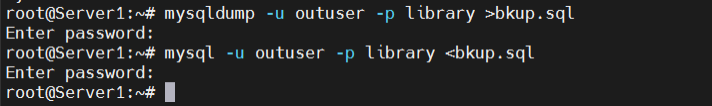

13. Transfer your local database to RDS AWS (Azure).  
14. Connect to your database.

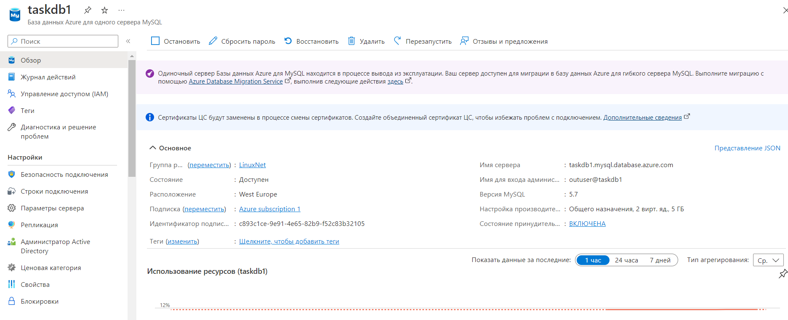

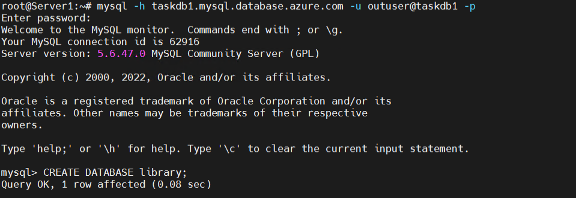

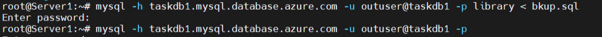

15. Execute SELECT operator similar step 6.

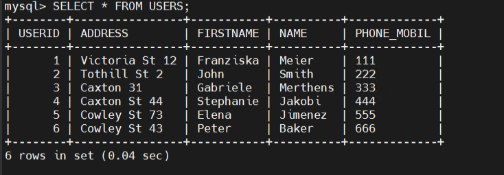

16. Create the dump of your database.

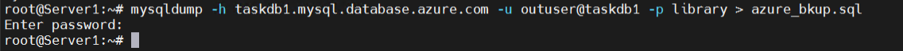

PART 3 – MongoDB

17. Create a database. Use the use command to connect to a new database (If it doesn't exist, Mongo will create it when you write to it).   
18\. Create a collection. Use db.createCollection to create a collection. I'll leave the subject up to you. Run show dbs and show collections to view your database and collections.   
19\. Create some documents. Insert a couple of documents into your collection. I'll leave the subject matter up to you, perhaps cars or hats.

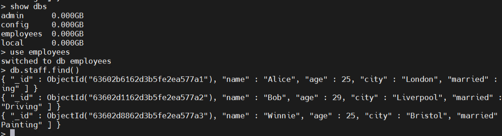

20. Use find() to list documents out

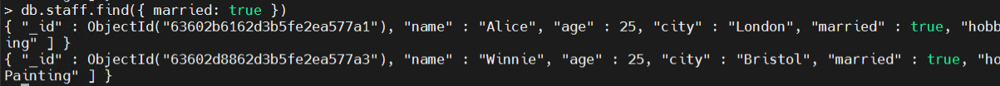
