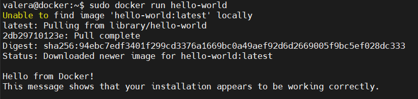
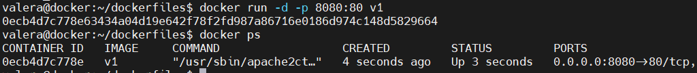
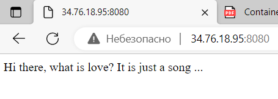
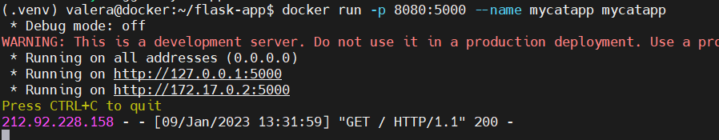
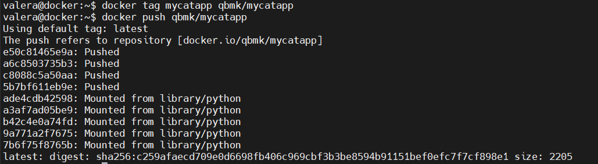
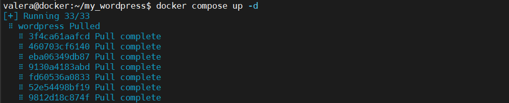
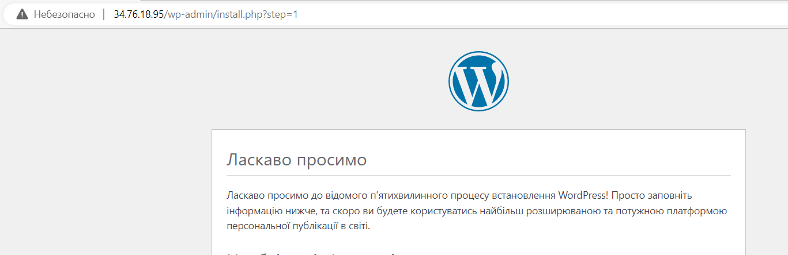

Docker practice basics

1.  Verify that Docker Engine is installed correctly by running the hello-world image.

    

2.  Create directory for Dockerfile(-s) and and dive into it. \$ mkdir dockerfiles \$ cd dockerfiles Edit it and add the commands with nano: \$ nano Dockerfile Finally build it: \$ docker build -t .

    

    

Webapps with Docker

1.  Create a Python Flask app using the Flask framework

    

2.  Pushing to docker registry

    

    Docker Compose

3.  Create a docker-compose.yml file that starts your WordPress blog and a separate MySQL instance with a volume mount for data persistence:

    

    

    Thank you!!!
