**Linux Networking**

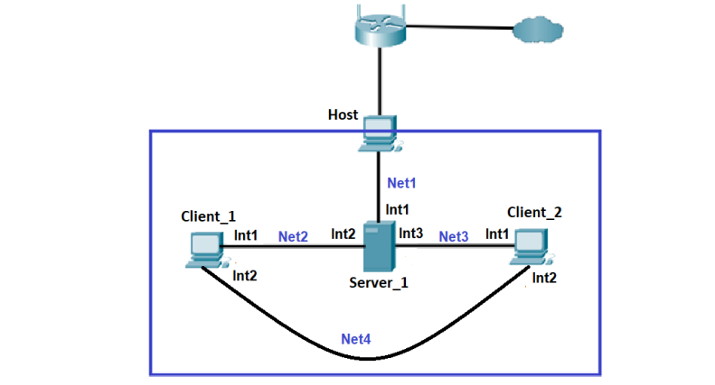

Net1 – 192.168.1.0/24

Net2 – 10.66.27.0/24

Net3 – 10.10.66.0/24

Net4 – 172.16.27.0/24

1.  **На Server_1 налаштувати статичні адреси на всіх інтерфейсах.**

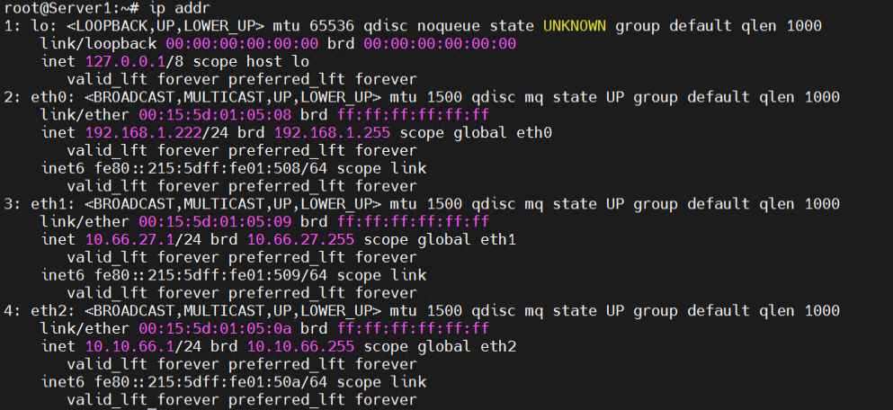

2.  **На Server_1 налаштувати DHCP сервіс, який буде конфігурувати адреси Int1 Client_1 та Client_2**

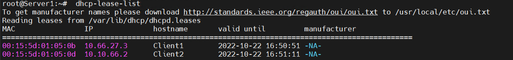

3.  **За допомогою команд ping та traceroute перевірити зв'язок між віртуальними машинами. Результат пояснити. Увага! Для того, щоб з Client_1 та Client_2 проходили пакети в мережу Internet (точніше щоб повертались з Internet на Client_1 та Client_2) на Wi-Fi Router необхідно налаштувати статичні маршрути для мереж Net2 та Net3.**

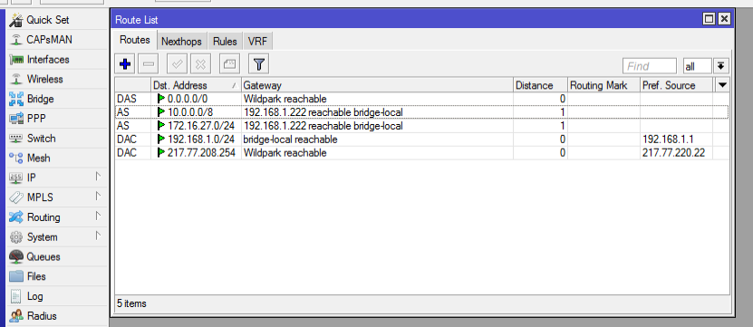

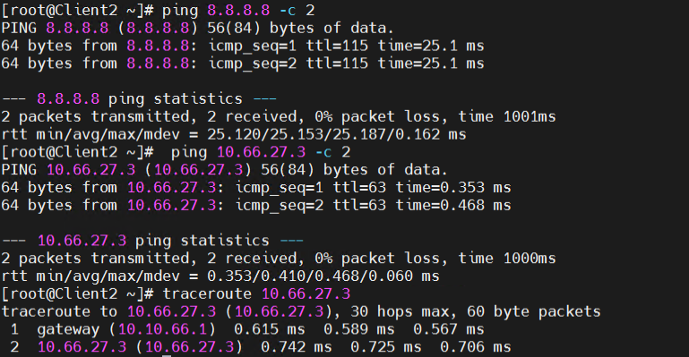

4.  **На віртуальному інтерфейсу lo Client_1 призначити дві ІР адреси за таким правилом: 172.17.D+10.1/24 та 172.17.D+20.1/24. Налаштувати маршрутизацію таким чином, щоб трафік з Client_2 до 172.17.D+10.1 проходив через Server_1, а до 172.17.D+20.1 через Net4. Для перевірки використати traceroute**

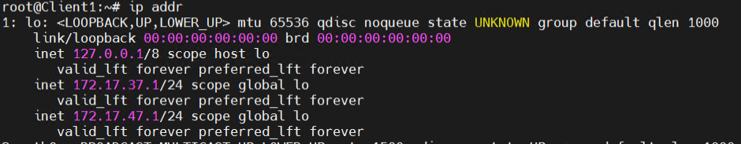

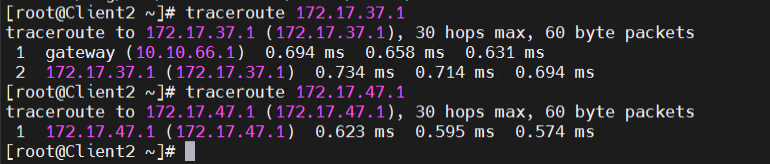

5.  **Розрахувати спільну адресу та маску (summarizing) адрес 172.17.D+10.1 та 172.17.D+20.1, при чому префікс має бути максимально можливим. Видалити маршрути, встановлені на попередньому кроці та замінити їх об’єднаним маршрутом, якій має проходити через Server_1.**

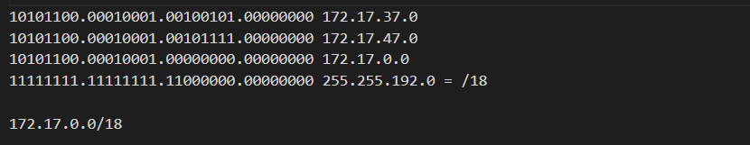

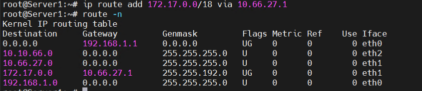

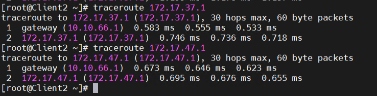

6.  **Налаштувати SSH сервіс таким чином, щоб Client_1 та Client_2 могли підключатись до Server_1 та один до одного.**

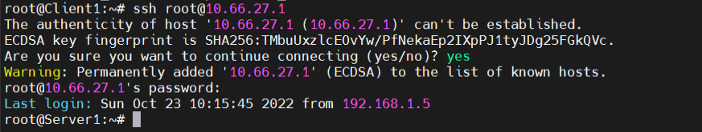

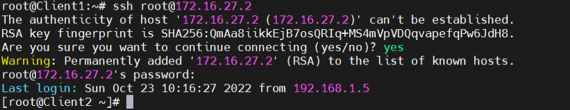

7.  **Налаштуйте на Server_1 firewall таким чином: • Дозволено підключатись через SSH з Client_1 та заборонено з Client_2 • З Client_2 на 172.17.D+10.1 ping проходив, а на 172.17.D+20.1 не проходив.**

**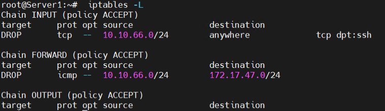**

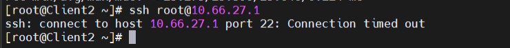

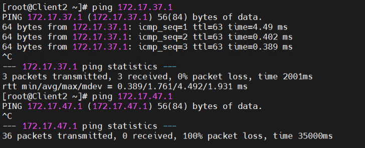

8.  **Якщо в п.3 була налаштована маршрутизація для доступу Client_1 та Client_2 до мережі Інтернет – видалити відповідні записи. На Server_1 налаштувати NAT сервіс таким чином, щоб з Client_1 та Client_2 проходив ping в мережу Інтернет.**

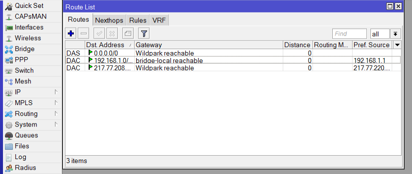

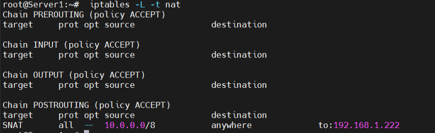

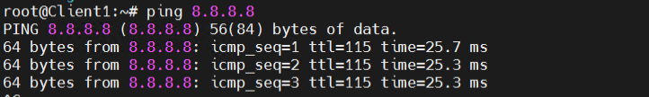
